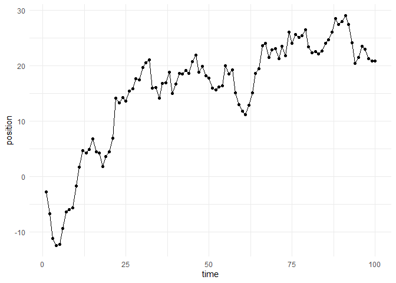

<!-- README.md is generated from README.Rmd. Please edit that file -->

# simplerc

[](https://mybinder.org/v2/gh///master?urlpath=rstudio)
Random Walks! A random walk is a stochastic simulation method that can
be used to model many phenomena, including animal movement and financial
markets. This repository contains a simple interface for simulating
Gaussian random walks.

### How to cite

Please cite this compendium as:

> Handley, T; Einstein, A; Francis, P; et al. (2021). Random Walks - A
> Magnum Opus. Accessed 06 Dec 2021. Online at
> <https://github.com/tomjhandley/simplerc>. ## Installation

This research compendium has been developed using the statistical
programming language R. To work with the compendium, you will need
installed on your computer the [R
software](https://cloud.r-project.org/) itself and optionally [RStudio
Desktop](https://rstudio.com/products/rstudio/download/).

You can clone the repository from this URL:
[simplerc](https://github.com/tomjhandley/simplerc). After unzipping: -
open the `.Rproj` file in RStudio - run `devtools::install()` to ensure
you have the packages this analysis depends on (also listed in the
[DESCRIPTION](/DESCRIPTION) file).

## Usage

Use `simulate_walk` to simulate a Gaussian random walk. You can define
the length of the simulation in steps (`t`) and the mean (`mu`) and
standard deviation (`sigma`) of the distribution used in the simulation.

``` r
library(simplerc)
t <- 100
mu <- 0.5
sigma <- 2
walk <- simulate_walk(t, mu, sigma)
```

To visualize the simulation, use the `plot_walk` function with the
output of `simulate_walk`.

``` r
plot_walk(walk)
```

<!-- -->

To estimate the parameters that were used for a simulation, use the
`fit_walk` function with the output from `simulate_walk`.

``` r
params <- fit_walk(walk)
params
#> $mu
#> [1] 0.2386638
#> 
#> $sigma
#> [1] 2.139589
```

For the example above, the estimated parameters of *μ* = 0.2386638 and
*σ* = 2.1395887 closely match the parameters used to generate the
simulation.

## Contents

The **analysis** directory contains:

-   [:file_folder: paper](/analysis/paper): R Markdown source document
    for manuscript. Includes code to reproduce the figures and tables
    generated by the analysis. It also has a rendered version,
    `paper.docx`, suitable for reading (the code is replaced by figures
    and tables in this file)
-   [:file_folder: data](/analysis/data): Data used in the analysis.
-   [:file_folder: figures](/analysis/figures): Plots and other
    illustrations
-   [:file_folder:
    supplementary-materials](/analysis/supplementary-materials):
    Supplementary materials including notes and other documents prepared
    and collected during the analysis.

### Licenses

**Text and figures :**
[CC-BY-4.0](http://creativecommons.org/licenses/by/4.0/)

**Code :** See the [DESCRIPTION](DESCRIPTION) file

**Data :** [CC-0](http://creativecommons.org/publicdomain/zero/1.0/)
attribution requested in reuse

### Contributions

We welcome contributions from everyone. Before you get started, please
see our [contributor guidelines](CONTRIBUTING.md). Please note that this
project is released with a [Contributor Code of Conduct](CONDUCT.md). By
participating in this project you agree to abide by its terms.
